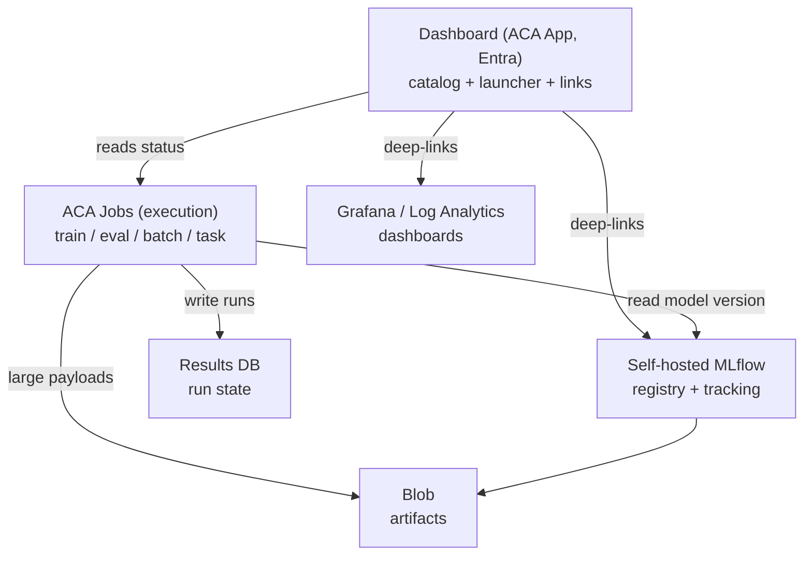

Status: Draft
Owner: ML platform team
Canonical for: Target planes, fixed architecture decisions, cross-document invariants
Depends on: none (this is the root architecture document)
Last reviewed: 2026-07-30

# 00 — Production architecture

## Outcome

A small ML team can train, evaluate, register, serve, and run scheduled or
on-demand batch workflows on Azure with a handful of managed building blocks and
no bespoke control plane. Runs are reproducible, model identity is exact,
operational state is queryable, and deploying new code can never strand a stale
worker.

## Production decisions

These are fixed. Downstream documents implement them; they do not re-litigate them.

### The four planes

The platform is four planes plus a thin dashboard. Everything else is a
consequence of these.

| Plane                       | Responsibility                                                   | Azure building block                                     |
| --------------------------- | ---------------------------------------------------------------- | -------------------------------------------------------- |
| **Execution**         | Run every workflow as an ephemeral, image-pinned task            | Azure Container Apps**Jobs**                       |
| **Model lifecycle**   | Track experiments, register model versions, store artifacts      | **Self-hosted MLflow** (ACA App + Postgres + Blob) |
| **Operational state** | Record status/output/error for every run, with batch granularity | **Generic results DB** (Postgres)                  |
| **Serving**           | Optional online HTTP inference at an exact model version         | Azure Container Apps**Apps**                       |

The **dashboard** (a lightweight ACA App) is a read-and-launch surface over these
planes; it holds no authoritative state of its own.

### Execution plane — ACA Jobs, always ephemeral

Every workflow is an ACA Job execution started from a **pinned image digest**.
When idle, nothing runs (scale to zero). Three trigger types cover all needs:

- **Schedule** — cron-defined periodic runs (nightly retrain, hourly scoring).
- **Manual** — on-demand runs started via the ACA execution API (from the
  dashboard or CI), always attributed to a caller for audit.
- **Event** — started in response to an event source when needed.

Because a Job execution is a fresh container from a fresh image, **a deploy is
just a Job-definition image bump**: the next execution runs new code, and there
is no worker process holding old code in memory. This single property is why we
do not need — and deliberately avoid — a long-running worker fleet.

### No control plane, no default broker

Linear multi-step workflows (extract → transform → score → publish) are an
ordinary Python script inside one Job. We do **not** run Durable Functions or any
orchestration engine, and we do **not** stand up a message broker or Celery
worker fleet in the baseline. Fan-out (batch inference) and "run until done"
continuation are expressed as **parent/child rows in the results DB plus a small
stateless rule** (see [04](./04-periodic-and-batch-workflows.md)). This keeps the
system inspectable with plain SQL and free of orchestration-engine version lock-in.

### Model lifecycle — self-hosted MLflow

We run MLflow ourselves at a pinned version, with a Postgres metadata backend and
Blob artifact store, on a small ACA App. Training and evaluation jobs log runs
and register model versions; the **registered version number is the canonical
model identity** used by serving and batch inference. We deliberately do not use
Azure ML's managed MLflow, whose server version lags upstream and constrains the
registry and evaluation features we depend on. Self-hosting keeps us free to pin
exact MLflow and library versions and to bring our own container images.

### Operational state — one generic results DB

A single Postgres table (Celery-result-backend style) records the state of
**every** job of every type:

| Column                          | Meaning                                                                              |
| ------------------------------- | ------------------------------------------------------------------------------------ |
| `id`                          | UUID, or a deterministic hash for idempotent items                                   |
| `parent_id`                   | NULL for a top-level run; set to group a run's sub-tasks/chunks                      |
| `name`                        | Workflow/task type identifier                                                        |
| `status`                      | `PENDING` \| `STARTED` \| `SUCCESS` \| `RETRY` \| `FAILURE` \| `REVOKED` |
| `output`                      | JSONB metadata (per-task-type shape; big payloads go to Blob)                        |
| `error`                       | Text/traceback on failure                                                            |
| `attempts`                    | Retry counter                                                                        |
| `triggered_by`                | `'schedule'` or the caller's email (audit)                                         |
| `created_at` / `updated_at` | Timestamps                                                                           |

Indexed on `(parent_id, status)`. This table is the canonical answer to "what
ran, what is running, what failed, and why." Batch inference uses a parent row
per batch and a child row per item/chunk, giving per-item success/failure without
any bespoke ledger. `RETRY` means transient/retriable; `FAILURE` means permanent.

### Serving — ACA Apps at an exact version

When online inference is needed, it runs as an ACA App whose container loads an
**exact MLflow model version** at startup (`models:/<name>/<version>`). Bringing
our own image means no framework/runtime lock-in. Rollback is a version change,
not a rebuild.

### Delivery lane — GitHub Actions is CI/CD only

GitHub Actions builds, tests, and scans images and updates ACA Job/App
definitions (image digest, env, schedule). It is **never** a workflow scheduler
or orchestrator — scheduling lives in ACA Job triggers, orchestration lives in
the job scripts and the results DB.

### Identity and access

Each workload — every Job, the serving App, the dashboard, MLflow, and CI — has
its own managed identity (CI via OIDC) with least-privilege roles. There is no
shared broad identity and no long-lived secret in an image or in Git. Manual
triggers are gated by a specific permission and audited via `triggered_by`.

### Observability

Three layers, no duplication:

- **Results DB** — canonical run state (what/why), queried by the dashboard.
- **Log Analytics / App Insights** — infra telemetry and alerting (job failed,
  run missed, permanent-failures over threshold, batch stalled).
- **Azure Managed Grafana** — deep operational dashboards. The platform
  dashboard deep-links to Grafana and MLflow rather than re-implementing charts.

## Shared concepts

- **Image digest** — the immutable identity of deployed code; a deploy changes a
  Job/App definition's digest.
- **Model version** — the immutable identity of a model in the self-hosted MLflow
  registry; used verbatim by serving and batch inference.
- **Run record** — a row in the results DB; the unit of operational truth.
- **Parent/child batch model** — one parent run row, one child row per item,
  enabling per-item retry and completion tracking.

## Target design

Downstream documents specify each plane:

- Foundation and identity — [01](./01-platform-foundation.md).
- Reproducible training/eval and MLflow lineage — [02](./02-reproducible-ml.md).
- LLM release artifact and evaluation — [03](./03-llm-release-artifacts.md).
- Scheduling, manual triggers, results DB, batch granularity, continuation —
  [04](./04-periodic-and-batch-workflows.md).
- Online serving — [05](./05-online-serving.md).
- CI/CD, promotion, rollback, observability, dashboard — [06](./06-release-and-operations.md).
- Golden path and phased plan — [07](./07-delivery-journey.md).
- Distributed/multi-GPU exception — [08](./08-multi-gpu-training.md).

## Runnable demonstration

The current repository demonstrates local wiring only (Compose stack, synthetic
data, stubbed inference). It does **not** demonstrate any production plane. A
passing `make up` is not evidence for this document.

## Failure modes and acceptance evidence

| Failure mode                                | Prevented by                                         | Acceptance evidence                                                                            |
| ------------------------------------------- | ---------------------------------------------------- | ---------------------------------------------------------------------------------------------- |
| Deploy leaves stale worker running old code | No long-running workers; image-pinned Job executions | Show that a digest bump changes the code the next execution runs, with no restart of any fleet |
| Model identity ambiguity                    | Registered MLflow version as canonical identity      | Serving/batch pins`models:/name/version`; logs show the resolved version                     |
| Run state scattered across tools            | Single generic results DB                            | Query returns full status/output/error for a run and its children                              |
| Control-plane version lock-in               | No orchestration engine; SQL-inspectable state       | Continuation logic runs from plain results-DB queries                                          |
| CI drifting into orchestration              | GitHub Actions restricted to build/deploy            | No schedule/orchestration logic in workflows; schedules live in ACA triggers                   |

## Open decisions

- *Postgres topology.* Default: **one burstable/small flexible server with two
  logical databases** (`mlflow` + `results`) — cheapest option that still isolates
  the two workloads (separate logins per identity, no cross-workload table
  access). Two databases on one server cost essentially nothing extra, so this is
  not a collapse-to-one-database decision. **Upgrade trigger:** split `results`
  onto its own server only if the shared server becomes a reliability bottleneck
  (resource contention, connection exhaustion, one workload destabilizing the
  other) — a connection-string change, not a data migration. Do not split
  preemptively.
- Whether online serving is needed at launch or batch-only initially.

## References

- [`mockups/workflow-dashboard.html`](./mockups/workflow-dashboard.html) — the
  dashboard surface this architecture feeds.
