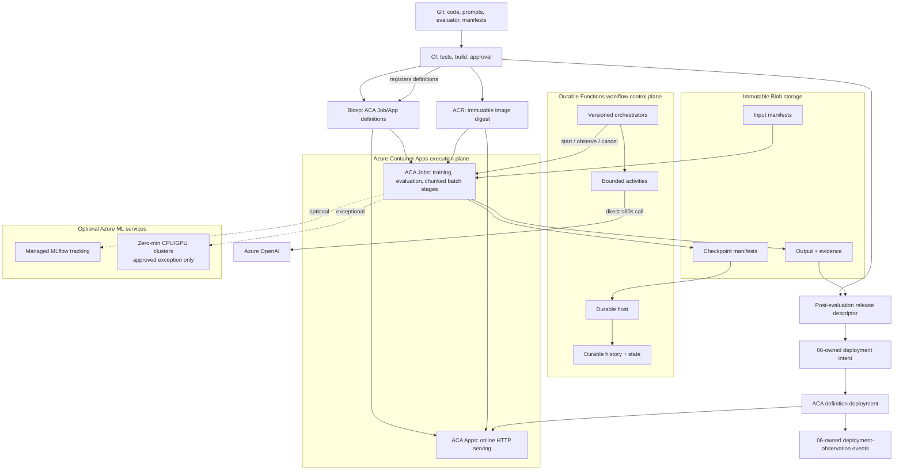

Status: Draft
Owner: ML platform team
Canonical for: Production service boundaries and platform invariants
Depends on: None
Last reviewed: 2026-07-29

# 00 — Production architecture

## Outcome

Provide one implementable target for training, evaluation, asynchronous work,
and online release. A production deployment is reproducible from Git,
immutable Blob manifests, a Durable Functions workflow definition, an ACA
definition/image digest, and non-secret environment configuration.

## Production decisions

1. **Workflow control plane.** Durable Functions is the workflow control plane.
   Orchestrators are versioned, registered, and deterministic — they never
   perform network or filesystem I/O, never hold document or model bytes, and
   never deploy or mutate ACA definitions. Durable history holds compact
   control state and pointers; task-hub internals are not a business broker.
2. **Execution plane.** Azure Container Apps is the default execution plane.
   ACA Jobs run coarse offline container stages (training, evaluation, chunked
   batch inference). ACA Apps serve HTTP online traffic only. Bicep deploys and
   version-controls all ACA Job/App definitions. Durable Functions starts,
   observes, and may cancel executions via Azure management APIs; it never
   modifies a deployed definition.
3. **No application queue.** Service Bus, Cosmos-ledger, outbox, KEDA queue
   scaling, DLQ, producer/worker identities, message locks, and reconciliation-
   as-queue are removed from the baseline architecture. Durable task-hub
   internals are not a business broker. An independently queryable business
   database is deferred until a proven retention, query, or transactional-
   side-effect requirement is documented.
4. **Blob is canonical.** Blob Storage owns immutable input, output, and
   checkpoint manifests. Blob digest/version is the canonical identity for all
   artifacts and data. No Azure ML data assets or model assets are required as
   runtime identity; they are optional references only.
5. **Azure OpenAI call boundary.** Calls that complete within 30–60 seconds run
   directly in a bounded Durable activity. Larger evaluations or batches use
   chunked ACA stages with bounded internal concurrency. Never launch an ACA
   Job per document.
6. **Azure ML is optional and narrow.** Optional managed MLflow tracking and
   model-catalog references. Optional zero-minimum CPU clusters and optional GPU
   clusters only after documented admission evidence showing distributed/RDMA or
   specialized GPU/capability that ACA cannot satisfy. No baseline AML jobs, AML
   pipelines, AML endpoints, Compute Instances, data assets, or model assets as
   runtime identity. ACA Jobs run ordinary training and evaluation. AML
   exceptions (if approved) are submitted and observed by Durable Functions,
   never as AML pipeline orchestration.
7. **Managed MLflow compatibility.** If Azure ML tracking is used, production
   uses an exact tested `mlflow==2.16.2` patch in the `<=2.16` compatibility
   line only for tracking and artifact logging. The local `mlflow>=3.0.0`
   dependency is separate.
8. **Prompt source and model artifact.** Prompts and templates are reviewed Git
   content. The releaseable unit is an immutable `mlflow.pyfunc.PythonModel`
   artifact containing the prompt bundle, schemas, deterministic adapter code,
   and its model manifest. Runtime never fetches prompt content by a mutable
   lookup. Evaluation and release approval, not registration, determine whether
   the candidate is eligible for a release descriptor.
9. **Identity.** Durable host, ACA stage jobs, ACA online apps, and CI have
   separate identities and least-privilege RBAC. No workload shares a broad
   fallback identity or stores a credential in an image or artifact.

## Shared workflow/stage contract

Every workflow run and every stage execution carries these identifiers:

| Field | Meaning |
|---|---|
| `workflow_id`, `workflow_version`, `workflow_digest` | Registered workflow definition identity |
| `orchestration_instance_id` | Single Durable orchestration run |
| `stage_id`, `stage_attempt` | Current stage within the orchestration and its attempt number |
| `aca_job_execution_id` | ACA Job execution returned by the start-job API |
| `aca_resource_id`, `aca_definition_digest` | ACA Job/App resource and the deployed template/definition digest |
| `image_digest` | Immutable ACR image ref for the stage container |
| `input_blob_refs[]` | Immutable input Blob URIs, version IDs, byte sizes, SHA-256 hashes |
| `output_destination`, `checkpoint_destination` | Blob paths for stage outputs and checkpoint manifests |
| `timeout`, `retry_classification`, `resource_profile` | Execution budget, retry policy, and compute profile |
| `provider_config_digest` | Resolved Azure OpenAI endpoint/deployment/quota config hash |
| `allowed_overrides` | Explicit set of parameters a caller may override |

Starting an ACA Job returns an execution ID recorded in Durable history. The
ACA Job writes a terminal immutable result manifest. ACA execution status alone
is not valid business-result evidence — only the committed result manifest is.

## Shared concepts

- **Exact reference:** an immutable content hash, Blob version ID, or service
  asset name/version. Human-friendly aliases may exist in an approval workflow
  but are never resolved by a production runtime.
- **Release descriptor:** the post-evaluation deployment input that joins
  exact workflow definition digest, ACA definition/image digests, model
  manifest digest, Blob artifact references, data/evidence hashes, source, and
  config; created only after evaluation and release approval.
- **Deployment intent:** the 06-owned hashed request to deploy a release
  descriptor using exact environment configuration references and a desired
  route. It is not an observation or an attestation that deployment succeeded.
- **Deployment-observation event:** a 06-owned append-only, individually hashed
  event recording what was observed for a deployment attempt, including its
  sequence, timestamp, outcome/health/failure, and revision/digests.
- **Lineage:** Git SHA → image/environment → workflow definition → Durable
  orchestration instance → stage attempts → ACA Job executions → Blob
  input/output manifests → candidate artifact → evaluation evidence → release
  descriptor → deployment intent → deployment-observation events.

## Target boundary



The resource and identity deployment order is authoritative in
[01 — Platform foundation](./01-platform-foundation.md). The workflow contract is
in [04 — Durable workflows](./04-durable-workflows.md).

## Cross-document contract interfaces

`03` owns the model manifest and defines its canonical hash. It defines
only the required interfaces for the later records; the release descriptor,
deployment intent, and deployment-observation event schemas are owned by [06 —
Release and operations](./06-release-and-operations.md).

| Record | Created when | Required downstream interface |
|---|---|---|
| GenAI model manifest (owned here) | Model artifact is built | Manifest digest, prompt/model-code hashes, request/response schemas, logical provider behavior, inference parameters, and contract version |
| Release descriptor (owned by 06) | After candidate evaluation and release approval | Workflow definition digest, ACA definition/image digests, model-manifest digest, dataset and evaluation-evidence IDs/content hashes, source commit, config version |
| Deployment intent (owned by 06) | When an approved release is requested for an environment | Release-descriptor digest, environment-specific provider/configuration references, and desired route |
| Deployment-observation event (owned by 06) | For each deployment observation | Event sequence, observed timestamp, outcome/health/failure, and observed revision/digests linked to the deployment intent |

The full model-manifest contract and the non-circular hash rule are in
[03](./03-genai-release-artifacts.md). A release cannot be created from an
evaluation result alone, and a deployment cannot replace its release descriptor
with mutable startup resolution.

## Current implementation versus planned target

**Existing, local demo stack only:** Docker Compose runs MLflow `3.5.0`,
Redis/Celery, PostgreSQL, and MinIO; `train.py` creates 200 synthetic rows;
Pandera validates the training data; the scikit-learn pipeline is logged
locally; and inference is stubbed. `infra/main.bicep` is a demo Bicep stack with
legacy resources including a non-Durable Function app.

**Planned:** Durable Functions orchestrators and activities, ACA Jobs for
training/evaluation/batch stages, ACA Apps for online serving, Blob manifest-
driven lineage, direct Azure OpenAI activities, Bicep-deployed ACA definitions,
and CI/release workflows. Production Durable host, ACA stages/apps, workflow
definitions, and CI do not exist yet. `make az-up` and the current Bicep are
not a working Azure runtime proof or production acceptance evidence.

## Runnable demonstration

```text
cd projects/ml-platform
make up
make train
make worker       # separate terminal
make producer     # separate terminal
```

This demonstrates local container wiring, synthetic Pandera validation, local
MLflow 3 logging, Celery task semantics, and Redis idempotency only. It does
not prove Durable Functions, ACA stages/apps, Blob manifest lineage, direct
AOAI activities, or ACA release behavior.

## Production implementation

1. Implement the identity, Blob, Durable host, ACA, and Azure OpenAI foundation
   in [01](./01-platform-foundation.md).
2. Implement manifest-driven ACA training/evaluation stages, immutable data
   manifests, and lineage in [02](./02-reproducible-ml.md).
3. Implement the GenAI model manifest, separate evaluator package, evidence,
   release inputs, and rollback contract in [03](./03-genai-release-artifacts.md).
4. Implement [04](./04-durable-workflows.md) and [05](./05-online-serving.md) in
   parallel, then [06](./06-release-and-operations.md), then [07](./07-delivery-journey.md).

## Failure modes/acceptance evidence

| Failure | Required evidence |
|---|---|
| Mutable reference changes behavior | Release descriptor, deployment intent, and observation events contain exact digests/asset versions and re-resolution reproduces their hashes |
| Wrong execution plane | Inventory contains ACA Jobs/Apps and Durable host; no production AML job/endpoint exists without approved rationale |
| Work is lost or duplicated | Durable history, checkpoint manifests, and idempotent stage commit tests pass; at most one committed result manifest |
| Aggregate evaluation hides failures | Durable activity or ACA stage has required aggregate metrics plus row-level evidence from the separately versioned evaluator |
| Release cannot roll back | Prior release descriptor and deployment intent redeploy the exact ACA definition, image, config, and route; observation events record the result |
| Demo is mistaken for production | Evidence labels local MLflow 3, Redis/Celery, synthetic data, and demo Bicep as existing only |

## Open decisions

- Select network/private-endpoint mode, ingress protection, and data retention.
- Approve Azure OpenAI quotas and the first optional GPU profile.
- Decide whether and when an independently queryable business database is
  required beyond Durable history + Blob manifests.

## References

- [Platform foundation](./01-platform-foundation.md)
- [Reproducible ML](./02-reproducible-ml.md)
- [GenAI release artifacts](./03-genai-release-artifacts.md)
- [Durable workflows](./04-durable-workflows.md)
- Current code: `src/ml_platform/`, `docker-compose.yml`, and `infra/`.
