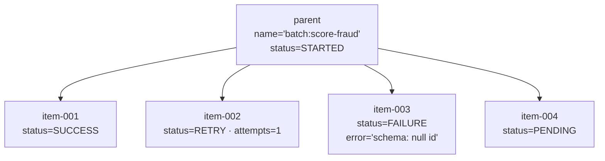

Status: Draft
Owner: ML platform team
Canonical for: Scheduling, manual triggers, the results DB schema, batch granularity, continuation
Depends on: [00 — Production architecture](./00-production-architecture.md), [01 — Platform foundation](./01-platform-foundation.md)
Last reviewed: 2026-07-30

# 04 — Periodic & batch workflows

## Outcome

Scheduled and on-demand workflows — nightly retrains, hourly scoring, ad-hoc
backfills, large batch-inference fan-outs — all run as ephemeral ACA Jobs and
record their state in one generic results DB. Batch inference tracks per-item
success/failure, distinguishes transient from permanent failures, and can "run
until done" without any orchestration engine, because all the state it needs lives
in the results DB.

## Production decisions

### Triggers: schedule, manual, event

Each workflow is an ACA Job with one or more triggers:

- **Schedule** — a cron expression on the Job definition (nightly retrain, hourly
  score). ACA starts a fresh execution; no always-on scheduler process.
- **Manual** — started via the ACA execution API from the dashboard or CI, always
  with a `triggered_by` caller for audit and gated by a scoped role.
- **Event** — started from an event source when a use case needs it.

> Manual triggering does **not** depend on the dashboard being up. The dashboard
> is just one caller of the ACA execution API; the same run can be started
> directly with `az containerapp job start …` (same identity, same audit) if the
> dashboard is unavailable.

Every execution is a fresh container from a pinned image, so a code deploy is a
digest bump and the next run is automatically new code.

### Linear multi-step = one script in one Job

A pipeline like extract → validate → score → publish is a single script inside one
Job execution. Steps are ordinary function calls; intermediate large data goes to
Blob; the run's status/output goes to the results DB. We do not decompose linear
pipelines into an orchestration graph.

### The generic results DB

One Postgres table records the state of every job of every type.

```sql
CREATE TABLE results (
    id           TEXT PRIMARY KEY,            -- UUID, or deterministic hash for idempotent items
    parent_id    TEXT NULL REFERENCES results(id),  -- NULL = top-level run; set = child of a run
    name         TEXT NOT NULL,               -- workflow/task type, e.g. 'batch:score-fraud'
    status       TEXT NOT NULL,               -- PENDING | STARTED | SUCCESS | RETRY | FAILURE | REVOKED
    output       JSONB NULL,                  -- per-task metadata; big payloads go to Blob
    error        TEXT NULL,                   -- traceback/message on failure
    attempts     INT NOT NULL DEFAULT 0,
    triggered_by TEXT NOT NULL,               -- 'schedule' or caller email
    created_at   TIMESTAMPTZ NOT NULL DEFAULT now(),
    updated_at   TIMESTAMPTZ NOT NULL DEFAULT now()
);
CREATE INDEX idx_results_parent_status ON results(parent_id, status);
```

Conventions:

- Each task type defines the shape of its `output` JSON (e.g. batch score:
  `{rows_in, rows_scored, model_version, output_blob, drift}`).
- **Big outputs go to Blob**; the results DB stores only metadata and the Blob
  reference. The results DB stays small and fast to query.
- `triggered_by` records **who asked for the run**, not what authorized it. For a
  scheduled run it is `'schedule'`; for a manual run it is the initiator's Entra
  identity (email/UPN), taken from the dashboard's Entra Easy Auth sign-in token
  (or the Azure CLI login for a direct start). This is distinct from the
  `id-dashboard` managed identity that *authorizes* the ACA execution call —
  authorization is by machine identity, attribution is by human identity.
- The dashboard and alerts read this table; it is the canonical operational truth.

### Status semantics

| Status      | Meaning                                                                |
| ----------- | ---------------------------------------------------------------------- |
| `PENDING` | Created, not yet started                                               |
| `STARTED` | Currently executing                                                    |
| `SUCCESS` | Completed successfully                                                 |
| `RETRY`   | Failed transiently and is eligible to be retried (timeout, 429, 5xx)   |
| `FAILURE` | Failed permanently (validation error, poison input, retries exhausted) |
| `REVOKED` | Cancelled                                                              |

The `RETRY` vs `FAILURE` distinction is the core of batch resilience: transient
failures are retried; permanent failures are quarantined, not retried forever.

### Batch inference: parent + child rows

A batch run is one **parent** row (`parent_id IS NULL`) plus one **child** row per
item or chunk (`parent_id = <batch id>`). This gives per-item granularity for free:

- Overall progress = counts of children by `status` under the parent.
- Per-item failure = the child row's `error`.
- Idempotency = the child `id` is a **deterministic hash of the item's identity**
  (`hash(batch_name + item_key)`), so re-processing an item is a no-op if it is
  already `SUCCESS`.



### Continuation: "run until done" as a stateless rule

Because all per-item state lives in the results DB, "keep going until the batch is
done" needs no orchestration engine and no in-memory state. A batch Job (or a
scheduled sweeper) applies one rule:

> Select children under this parent with `status IN (PENDING, RETRY)` and
> `attempts < max_attempts`. Process them (idempotently). Repeat.
>
> **Stop** when: no such children remain (**done** → mark parent `SUCCESS` or
> `FAILURE` if any permanent failures), OR the iteration made **no progress**
> (circuit breaker → mark parent `FAILURE`/alert), OR `max_iterations` is reached
> (safety cap → alert).

This is safe to re-run at any time: a crashed or redeployed batch Job simply
re-evaluates the rule against the results DB and continues. There is no durable
orchestrator because the database *is* the durable state.

### No broker by default; documented upgrade path

The baseline processes items in-Job (a bounded worker pool inside one execution,
or a small fan-out of sibling Jobs) — no message broker, no Celery worker fleet.
If batch fan-out routinely exceeds roughly a few hundred concurrent units, or you
need real queue backpressure and cross-run scheduling, adopt:

> **Celery as a library** with tasks defined in the same image, workers running as
> **short-lived KEDA-triggered ACA Jobs** that drain a queue and exit
> (still ephemeral and image-pinned), backed by **managed Azure Cache for Redis**.

Crucially, **never a long-running Celery worker daemon** — that reintroduces the
stale-code problem the whole design avoids. The results-DB schema above is already
Celery-result-backend-shaped, so this upgrade reuses the same run store.

## Shared concepts

- **Results DB** — the single generic run store; canonical operational truth.
- **Parent/child rows** — batch granularity without a bespoke ledger.
- **Deterministic item id** — idempotency key = hash of item identity.
- **Continuation rule** — stateless "process PENDING/RETRY until done or
  circuit-breaker"; replaces durable orchestration.

## Target design

- A results-DB module in `src/ml_platform/` with helpers: `create_run`,
  `create_children`, `mark(status, output|error)`, `pending_children`,
  `finalize_parent`.
- Batch Jobs bound to `id-jobs-batch`; they read a pinned `models:/name/version`,
  write outputs to Blob, and drive the continuation rule.
- Scheduled Jobs (cron) and manual Jobs (dashboard/API) share the same results-DB
  contract, so the dashboard shows all workflows uniformly.

## Runnable demonstration

Not yet demonstrated. Acceptance requires a batch Job that creates a parent +
children, processes items idempotently, distinguishes RETRY/FAILURE, and completes
via the continuation rule — verifiable by querying the results DB.

## Failure modes and acceptance evidence

| Failure mode                      | Prevented by                                      | Acceptance evidence                                                |
| --------------------------------- | ------------------------------------------------- | ------------------------------------------------------------------ |
| Stale worker after deploy         | Ephemeral image-pinned Job executions             | Digest bump → next execution runs new code; no fleet restart      |
| Whole batch fails on one bad item | Per-item child rows; FAILURE quarantines one item | One child`FAILURE`, siblings still `SUCCESS`; parent completes |
| Transient errors kill the run     | RETRY status + attempts + continuation            | RETRY children re-processed until success or attempts exhausted    |
| Duplicate processing              | Deterministic item id + idempotency               | Re-running a completed item is a no-op                             |
| Runaway retries / stuck batch     | Circuit breaker + max-iterations cap              | No-progress iteration stops and alerts; parent marked FAILURE      |
| Need for orchestration engine     | State lives in results DB                         | Continuation runs from plain SQL; a crashed Job resumes correctly  |

## Open decisions

- In-Job worker-pool size versus sibling-Job fan-out for the baseline.
- Default `max_attempts` and `max_iterations` per workflow type.
- The concrete trigger for adopting the Celery/Redis upgrade path.

## References

- Why ephemeral Jobs and the results DB — [00](./00-production-architecture.md).
- Identities for batch/scheduled Jobs — [01](./01-platform-foundation.md).
- Observability, alerts, and the dashboard over these rows — [06](./06-release-and-operations.md).
- Dashboard surface — [`mockups/workflow-dashboard.html`](./mockups/workflow-dashboard.html).
