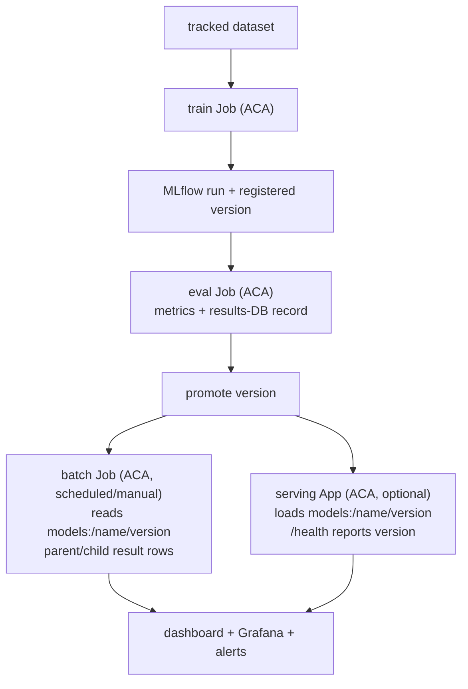

Status: Draft
Owner: ML platform team
Canonical for: The golden path and the phased delivery/progress register
Depends on: all of 00–06, and [08 — Multi-GPU training](./08-multi-gpu-training.md)
Last reviewed: 2026-07-30

# 07 — Delivery journey

## Outcome

A single "golden path" a model travels from data to production, and a phased plan
that builds the platform in an order where each phase is independently useful. The
plan is sequenced so a small team is never blocked on machinery it does not yet
need.

## The golden path

Every step has a complete Compose implementation first. The Azure adapter then
uses ACA workloads, managed identities, and the same model/results contracts;
every model is a registry version, every run is a results-DB record, and every
human action is audited.

## Phased plan

### Phase 0 — Foundation

Provision the [01](./01-platform-foundation.md) footprint as IaC: registry,
container-apps environment + Log Analytics, Postgres with `mlflow` + `results`
databases, storage, Key Vault, Grafana, and per-workload identities. Stand up the
self-hosted MLflow App. **Useful because:** everything else has a home and an
identity.

### Phase 1 — Reproducible training + registry

Ship the train/eval workload image ([02](./02-reproducible-ml.md)) first through
Compose, then as ACA Jobs logging to MLflow and writing results-DB records.
**Useful because:** the team gets reproducible models with recoverable lineage,
independent of serving.

### Phase 2 — Results DB + first scheduled/batch workflow

Ship the results-DB module and one scheduled or batch workflow
([04](./04-periodic-and-batch-workflows.md)) with parent/child rows and the
continuation rule. **Useful because:** the operational backbone (run state,
retries, idempotency) exists and is exercised by a real workflow.

### Phase 3 — Serving (if in scope) + promotion/rollback

Ship the serving App ([05](./05-online-serving.md)) and the promotion/rollback
mechanics ([06](./06-release-and-operations.md)). **Useful because:** models reach
online consumers with safe, version-based rollback. Skip if batch-only.

### Phase 4 — Observability + dashboard

Wire alerts, Grafana dashboards, and the catalog/launcher dashboard
([06](./06-release-and-operations.md)). **Useful because:** the team can see and
launch everything, and gets paged on real failures.

### Phase 5 — LLM artifacts

Add pyfunc packaging + evaluator ([03](./03-llm-release-artifacts.md)) reusing
the same registry, promotion, serving, and batch paths. **Useful because:** an LLM
ships through the existing machinery, not a new one.

### Exception track — Multi-GPU training

Only if a workload needs distributed/multi-GPU training, add the admission-gated
Azure ML path ([08](./08-multi-gpu-training.md)), logging to the same MLflow. Not
on the critical path.

### Upgrade track — Broker (only if forced)

Only if batch fan-out routinely exceeds a few hundred concurrent units or needs
queue backpressure, adopt Celery-as-a-library on short-lived KEDA-triggered ACA
Jobs + managed Redis ([04](./04-periodic-and-batch-workflows.md)). Never
long-running workers.

## Progress register

| Phase | Scope | State |
|---|---|---|
| 0 | Foundation + self-hosted MLflow | Compose runnable; Terraform/ACA adapter implemented |
| 1 | Train/eval Jobs + MLflow lineage | Shared image and entrypoints implemented |
| 2 | Results DB + first workflow | Compose and ACA batch paths implemented |
| 3 | Serving + promotion/rollback | Compose and ACA serving paths implemented |
| 4 | Observability + dashboard | Dashboard, alerts, and smoke checks implemented |
| 5 | LLM artifacts | Shared pyfunc entrypoints and local/cloud adapters implemented |
| Exc. | Multi-GPU (AML) | Not started (exception) |
| Upg. | Broker (Celery/Redis) | Not started (only if forced) |

Update this register as phases land; a phase is "done" when its document's
acceptance evidence is demonstrated, not when local code runs.

## Failure modes and acceptance evidence

| Failure mode | Prevented by | Acceptance evidence |
|---|---|---|
| Building machinery before it's needed | Phased, independently-useful order | Each phase demonstrable on its own |
| "Done" claimed from a local demo | Per-document acceptance evidence | Register cites the evidence, not `make up` |
| Critical path blocked on exceptions | Multi-GPU/broker off the main track | Phases 0–5 ship without them |

## Open decisions

The per-document **Open decisions** are **lower priority but required**: none of
them block *starting* a phase, but each must be resolved before its owning phase
is considered *done*. Resolve a decision when its phase comes up, not before —
deciding early is a form of the over-engineering this plan avoids.

- Whether Phase 3 (serving) is in launch scope or deferred (batch-only launch).

## References

- All plane documents [00](./00-production-architecture.md)–[06](./06-release-and-operations.md),
  [08](./08-multi-gpu-training.md).
