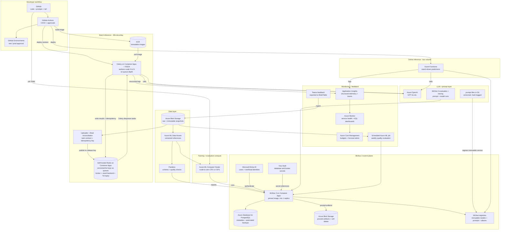
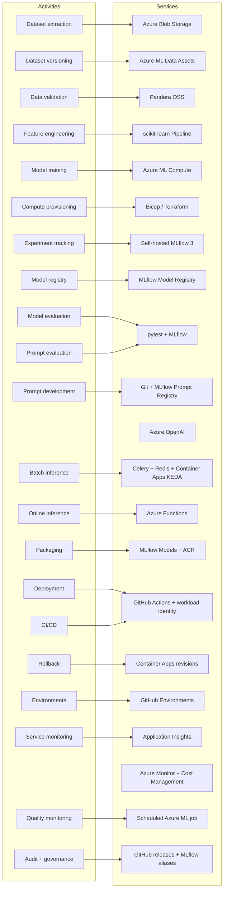
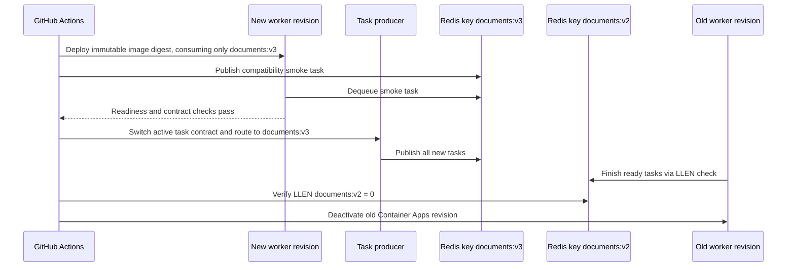

# MLOps Services Diagram

## Architecture overview

## Service-to-activity mapping

## Stale-worker-safe rollout

Queue workers do not receive HTTP traffic, so Container Apps traffic splitting cannot stop an old revision from fetching a new task. Batch releases therefore use multiple-revision mode and release-specific Redis list keys such as `documents:v3`.

Every task includes `task_contract_version`, `producer_release`, an idempotency key, and exact model and prompt versions. Celery workers consume only their configured release key, use late acknowledgement, reject tasks with unsupported contracts, and handle `SIGTERM` as a warm shutdown. Deactivation occurs only after `LLEN <release-key>` reports zero remaining tasks; otherwise the workflow stops and alerts. Rollback routes producers back to the preceding key and revision only when the task contract is backward-compatible.

## What is NOT Azure ML

| Activity | Service used | Why not Azure ML |
|---|---|---|
| Batch inference (30k docs) | Celery + self-hosted Redis + Container Apps + KEDA | Azure ML batch endpoints wrap a scoring script; this workload is durable task orchestration around Azure OpenAI calls. Redis lists provide versioned release keys; KEDA scales to zero natively. |
| Online inference (low volume) | Azure Functions | Managed online endpoints charge always-on compute; Functions scale to zero between requests. |
| LLM calls | Azure OpenAI | Azure ML has no LLM hosting role here; it only logs runs. |
| Prompt management | Git + MLflow 3 Prompt Registry | Git reviews prompt source; immutable registry versions and aliases control deployment. Azure ML's MLflow integration cannot provide the required MLflow 3 APIs. |
| CI/CD | GitHub Actions + ACR | Azure ML pipelines are for ML jobs, not app deployment. |
| Service monitoring | Application Insights + Azure Monitor + Log Analytics | Real-time health dashboards and custom KQL workbooks cover all services; MLflow, Redis, PostgreSQL, and worker health are all monitored from one pane. |
| Deployment + rollback | Versioned Redis keys, Container Apps revisions, and immutable Function packages | Key routing prevents stale worker revisions from accepting new task contracts. Azure ML's deployment surface only covers its own endpoints. |
| Data validation | Pandera (OSS) | Azure ML has no built-in data validation; it must be added as a pipeline step. |
| Feature engineering | scikit-learn Pipeline (OSS) | Azure ML has no feature store; pipeline packaging in MLflow model is standard OSS. |

## What is self-hosted MLflow 3

| Capability | Implementation | Operating implication |
|---|---|---|
| Tracking, evaluation, and tracing | Pinned MLflow 3 image on Container Apps | The team owns image updates, availability monitoring, and client compatibility. |
| Metadata and registry state | Azure Database for PostgreSQL | Automated backups are enabled; schema migrations require a pre-upgrade backup and tested restore. |
| Model, evaluation, and trace artifacts | Blob Storage through MLflow's artifact proxy | Clients need MLflow access, not direct Blob credentials. Enable soft delete and lifecycle rules. |
| Model and prompt promotion | Immutable versions plus `candidate`, `staging`, and `champion` aliases | Only CI may mutate protected aliases; deployments resolve and record the exact version. |
| Authentication | Entra ID for users and workloads; secrets in Key Vault | Browser and noninteractive MLflow clients must both be tested before production use. |

## What IS Azure ML

| Activity | Service used | Why Azure ML |
|---|---|---|
| Training jobs | Azure ML compute cluster (scale-to-zero) | Quota-backed, reproducible environments, job definitions in Git. |
| GPU training / fine-tuning | Azure ML compute cluster with GPU SKU | Managed GPU quota, reproducible multi-node jobs, and logging to the self-hosted MLflow server. |
| Dataset versioning | Azure ML data assets | Immutable references to Blob paths; integrated with jobs. |
| Quality monitoring | Scheduled Azure ML evaluation job | Uses scale-to-zero compute and logs results to the self-hosted MLflow 3 server. |
